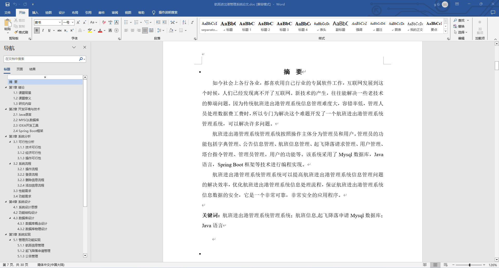
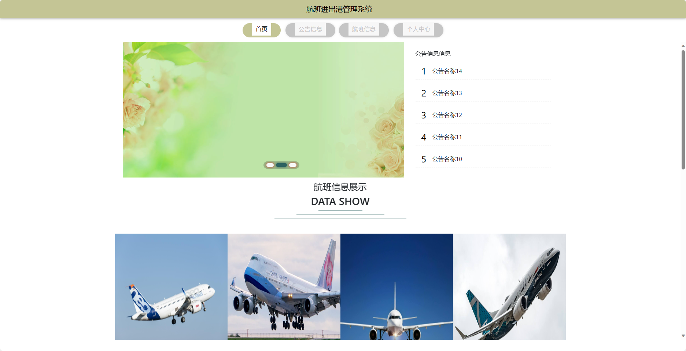
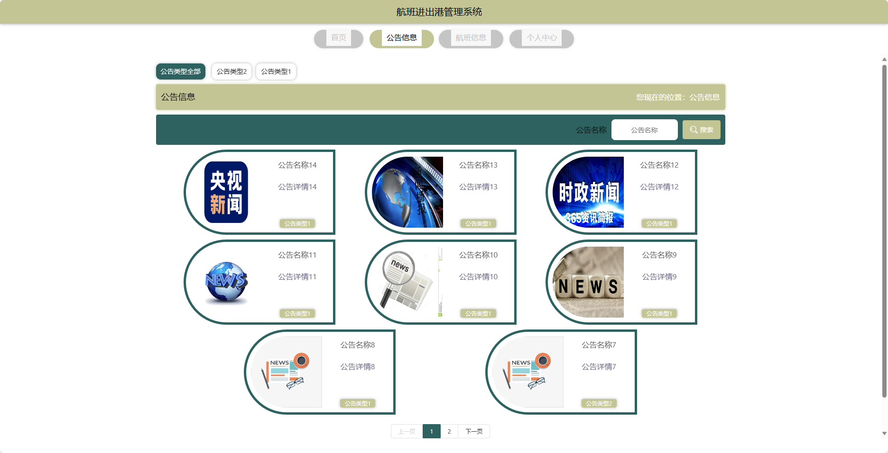
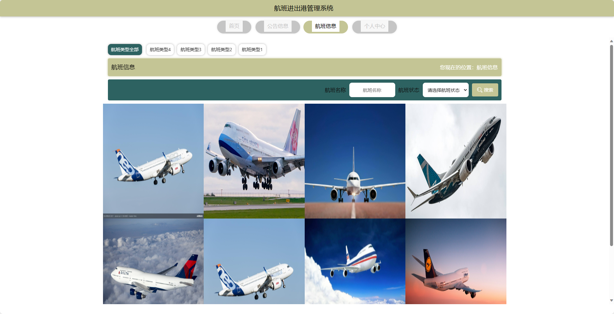
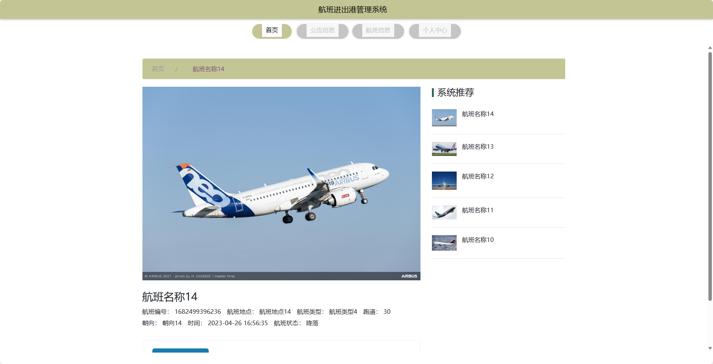
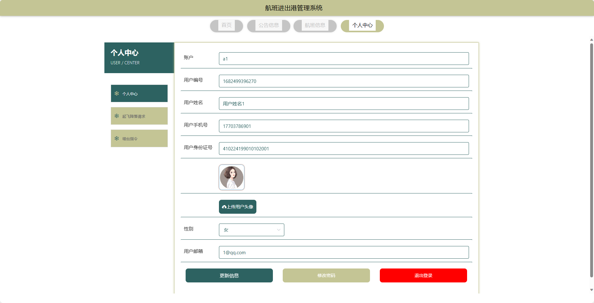
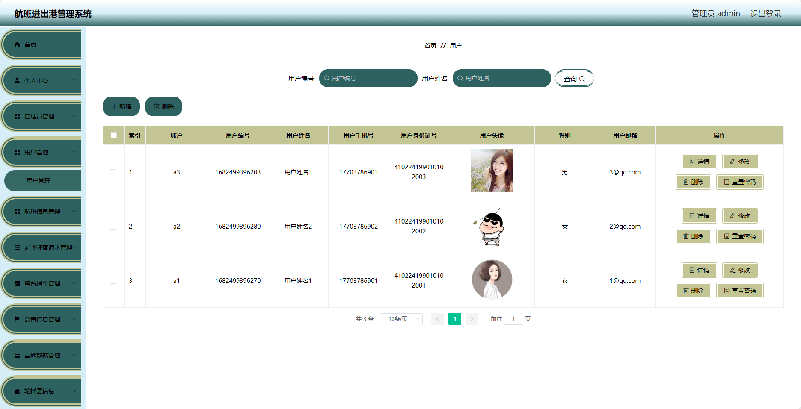
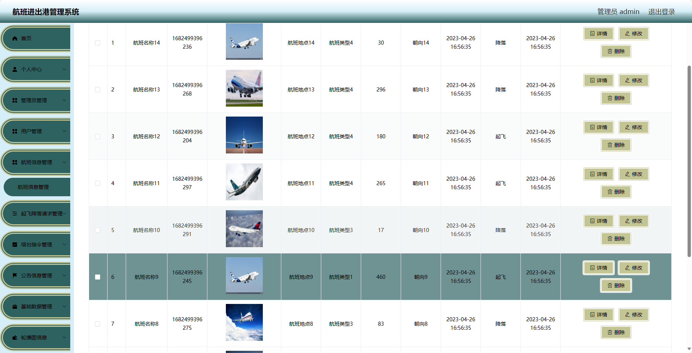
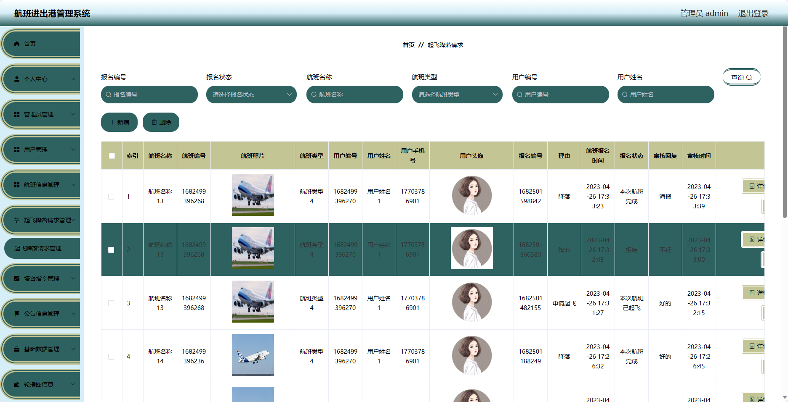
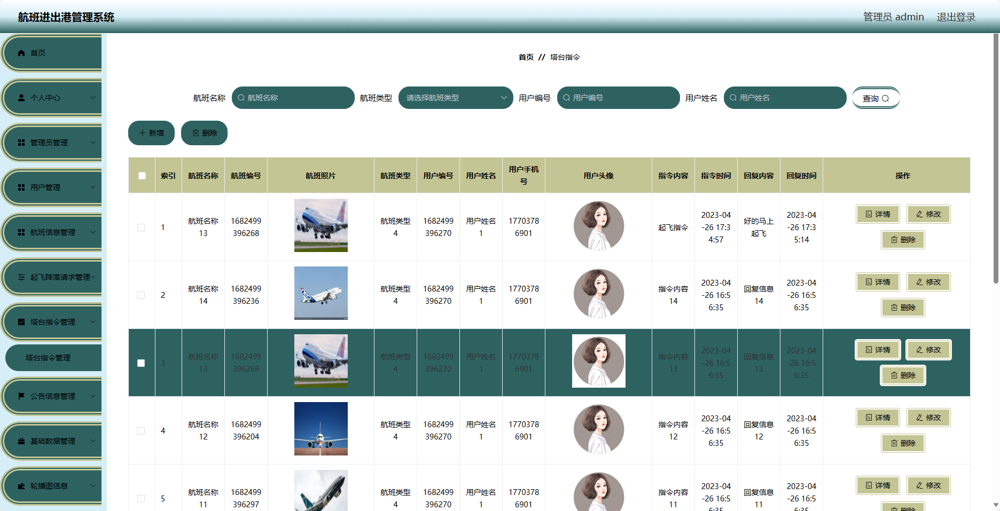

基于Springboot的航班进出港管理系统（程序+论文）
=
### 完整代码获取地址：从戎源码网 ([https://armycodes.com/](https://armycodes.com/))
### 作者微信：19941326836  QQ：952045282 
### 承接计算机毕业设计、Java毕业设计、Python毕业设计、深度学习、机器学习
### 选题+开题报告+任务书+程序定制+安装调试+论文+答辩ppt 一条龙服务
### 所有选题地址https://github.com/nature924/allProject

一、项目介绍
---
基于Spring Boot框架实现的航班进出港管理系统，系统包含两种角色：管理员、用户,系统分为前台和后台两大模块，主要功能如下。
### 系统角色：
- 管理员：负责管理系统的整体运行，包括管理员、公告信息、基础数据和轮播图等管理。
- 用户：使用系统查询公告信息、航班信息，进行起飞降落请求以及接收塔台指令。

### 系统模块：

### 前台模块：
- 首页：展示系统的概览信息和重点推荐内容。
- 公告信息：展示系统发布的重要公告信息。
- 航班信息：提供用户查询航班信息的功能。
- 个人中心：用户可以管理个人信息，包括修改密码等操作。

### 后台模块（管理员）：
- 个人中心：管理员可以管理个人信息，包括修改密码等操作。
- 管理员管理：管理员可以管理系统的管理员账号，包括添加管理员、编辑管理员、删除管理员等操作。
- 用户管理：管理员可以管理系统的用户账号，包括查看用户信息、禁用用户等操作。
- 航班信息管理：管理员可以管理系统的航班信息，包括添加航班、编辑航班、取消航班等操作。
- 起飞降落请求管理：管理员可以处理用户提交的起飞降落请求。
- 塔台指令管理：管理员可以发布和管理塔台指令信息。
- 公告信息管理：管理员可以发布和管理系统的公告信息。
- 基础数据管理：管理员可以管理系统的基础数据，如航班类型、机场信息等。
- 轮播图信息：管理员可以管理系统首页的轮播图信息

二、项目技术
---
- 编程语言：Java
- 数据库：MySQL
- 项目管理工具：Maven
- 前端技术：VUE、HTML、Jquery、Bootstrap
- 后端技术：Spring、SpringMVC、MyBatis

三、运行环境
---
- 操作系统：Windows、macOS都可以
- JDK版本：JDK1.8以上都可以
- 开发工具：IDEA、Ecplise、Myecplise都可以
- 数据库: MySQL5.7以上都可以
- Tomcat：任意版本都可以
- Maven：任意版本都可以

四、运行截图
---
### 论文截图：

### 程序截图：

